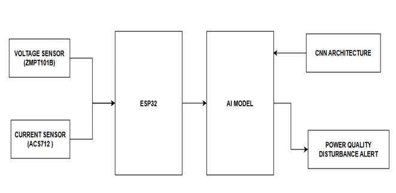
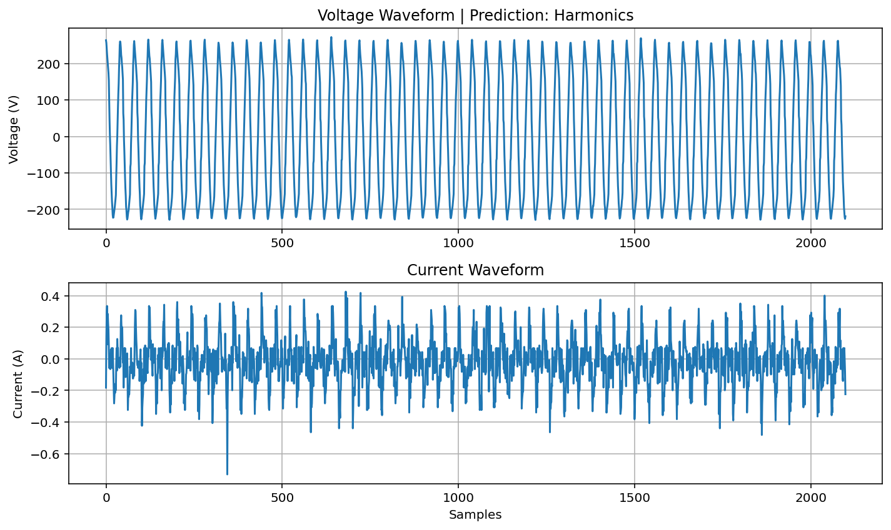

# AI-Based Power Quality Classification

<p align="center">
  <strong>Machine learning for real-time electrical disturbance monitoring</strong>
</p>

<p align="center">
  
  
  
</p>

## Project at a Glance

| Item | Details |
|---|---|
| Domain | Power-quality monitoring |
| Signals | Voltage and current |
| AI model | 1D CNN |
| Disturbances | Normal, Sag, Swell, Interruption, Transient, Harmonics, Flicker, Notching |
| Runtime | Python + serial acquisition |
| Status | Academic engineering prototype |

## Overview

This project combines embedded electrical measurements with a TensorFlow/Keras classification workflow to identify common power-quality disturbances from voltage/current signal windows.

## System & Results

<p align="center">
  
  
</p>

## AI Pipeline


## Technology Stack

- Python
- TensorFlow / Keras
- NumPy
- scikit-learn
- Matplotlib
- PySerial
- ESP32 / embedded acquisition

## Repository Structure

```text
power-quality/
├── code/
│   ├── generate_dataset.py
│   ├── train_cnn.py
│   ├── realtime_predict.py
│   └── esp32_power/
├── dataset/
├── models/
├── Components/
├── Result/
├── requirements.txt
└── .gitignore
```

## Setup

```bash
git clone https://github.com/shaiksadik1725-droid/power-quality.git
cd power-quality
pip install -r requirements.txt
python code/train_cnn.py
```

For live monitoring, configure the serial port and model path in `code/realtime_predict.py`, connect the acquisition hardware, and run the script.

## Engineering Notes

The repository includes both machine-learning code and embedded-system material, making the signal path traceable from acquisition through classification and visualization.

## Future Work

- Remove machine-specific absolute paths
- Use a single validated inference path for live classification
- Add RMS, THD, frequency, and power-factor features
- Add event logging and streaming plots
- Validate against controlled laboratory disturbances
- Add automated model tests

## Author

**Sadik Shaik**

Computer Engineering · Artificial Intelligence · Power Systems
